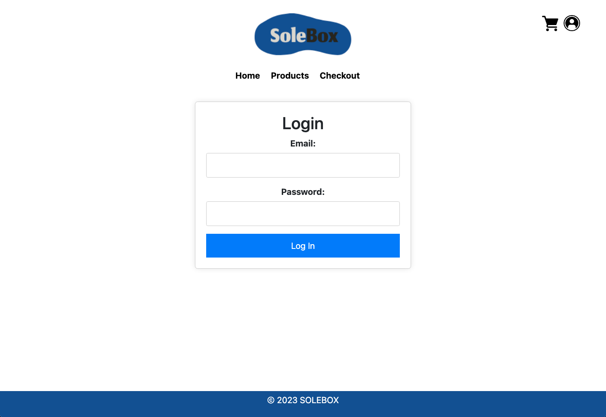

# Term3_DV200_JarrydCarelse_221267
Term 3 readme file with demonstration video

<h5 align="center" style="padding:0;margin:0;">Jarryd Carelse</h5>
<h5 align="center" style="padding:0;margin:0;">221267</h5>
<h6 align="center">DV200 2023</h6>
 

  
  
  <h3 align="center">DV200 Term 3</h3>

  

Solebox is an ecommerce website designed for selling a variety of sneakers. It leverages a MongoDB database to provide product information and images to users. This platform is built using React.js, HTML, CSS, Bootstrap, and incorporates design work created with Figma. Solebox offers a wide range of sneakers for online shoppers, ensuring a seamless shopping experience.

  
    
    
    
   <a href="path/to/demonstration/video">View Demo</a>
    ·
    <a href="https://github.com/username/projectname/issues">Report Bug</a>
    ·
    <a href="https://github.com/username/projectname/issues">Request Feature</a>

<!-- TABLE OF CONTENTS -->
## Table of Contents

* [About the Project](#about-the-project)
  * [Project Description](#project-description)
  * [Built With](#built-with)
* [Getting Started](#getting-started)
  * [Prerequisites](#prerequisites)
  * [How to install](#how-to-install)
* [Features and Functionality](#features-and-functionality)
   * [Wireframes](#wireframes)
* [Development Process](#development-process)
   * [Implementation Process](#implementation-process)
        * [Highlights](#highlights)
        * [Challenges](#challenges)
   * [Future Implementation](#peer-reviews)
* [Final Outcome](#final-outcome)
    * [Mockups](#mockups)
    * [Video Demonstration](#video-demonstration)
* [Conclusion](#conclusion)
* [License](#license)
* [Contact](#contact)

<!--PROJECT DESCRIPTION-->

### Project Description

Solebox is an online destination for sneaker enthusiasts and fashion-conscious consumers. It allows users to explore, browse, and purchase a diverse collection of sneakers, ranging from classic styles to the latest releases. The website provides detailed information about each product, including images, descriptions, prices, and available sizes, ensuring that shoppers can make informed choices. Whether you're looking for the perfect pair of sneakers for your collection or a trendy addition to your wardrobe, Solebox has you covered.

Technologies

### Built With

* VS Code
* React.js
* MongoDB
* Insomnia 
* HTML/CSS
* Figma

<!-- GETTING STARTED -->
<!-- Make sure to add appropriate information about what prerequesite technologies the user would need and also the steps to install your project on their own mashines -->
## Getting Started

The following instructions will get you a copy of the project up and running on your local machine for development and testing purposes.

### How to install

### Installation
To run Solebox locally or contribute to the project, follow these steps:

Clone the Repository:

bash
Copy code
git clone [YourRepositoryURL]
Install Dependencies:

bash
Copy code
cd Solebox
npm install
Start the Development Server:

bash
Copy code
npm start
The website will be accessible at http://localhost:3000.
<!-- FEATURES AND FUNCTIONALITY-->

 

 

 

 

## Development Process

Technology Stack

Back-end: PHP
Database: MySQL (using XAMPP)
Front-end: HTML, CSS, JavaScript
Development Phases

Ideation and Wireframing: Using Figma, the project's wireframes and user interface were designed to create a vision for the online store's look and feel.

Database Integration: MongoDB was employed to store and manage product information and images. This facilitated dynamic product listings on the website.

Front-end Development: React.js, HTML, and CSS were utilized to create the user interface. Bootstrap was employed for a responsive and visually appealing design.

Ecommerce Functionality: Ecommerce features were implemented to enable users to browse products, view details, add items to the cart, and make secure payments.

Testing and Quality Assurance: The website underwent rigorous testing to ensure it functioned flawlessly across different devices and browsers.

#### Challenges
##Challenges Faced

*Data Management and Database Design:
Designing a database schema for product information and images can be challenging, especially when dealing with a large number of products. Ensuring data consistency, integrity, and efficient queries in MongoDB may have required careful planning and consideration.

*Responsive Design: Creating a responsive design that works well on various screen sizes and devices can be challenging. Ensuring that the website is user-friendly and visually appealing on both desktop and mobile platforms may have required extensive CSS and layout adjustments.

<!-- VIDEO DEMONSTRATION -->
### Video Demonstration

To see a run through of the application, click below:

[View Demonstration](https://drive.google.com/file/d/1zpsajCg-3OjtIjLyPYsV6NHotNh35xoy/view?usp=sharing
)

<!-- AUTHORS -->
## Authors

* **Jarryd Carelse** 

<!-- LICENSE -->
## License

Distributed under the MIT License. See `LICENSE` for more information.\

<!-- LICENSE -->
## Contact

* **Jarryd Carelse** - [221267@virtualwindow.co.za](mailto:email@address)
